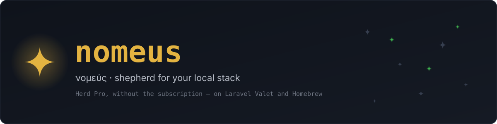
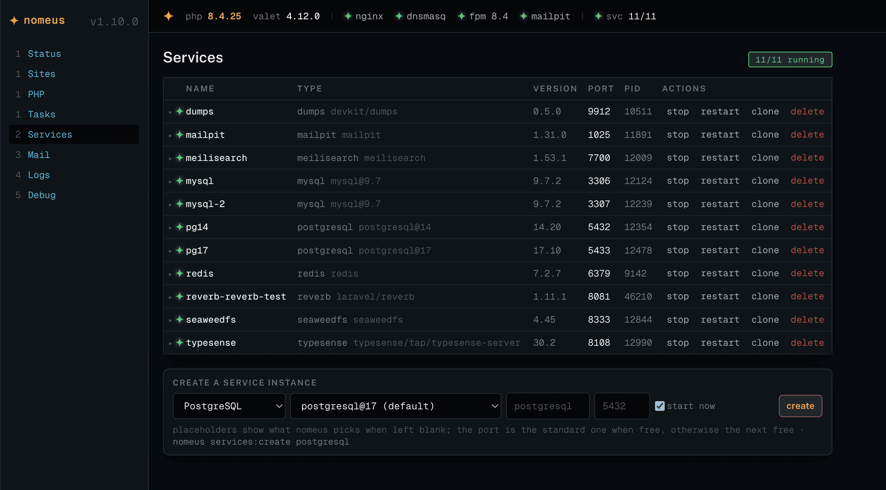
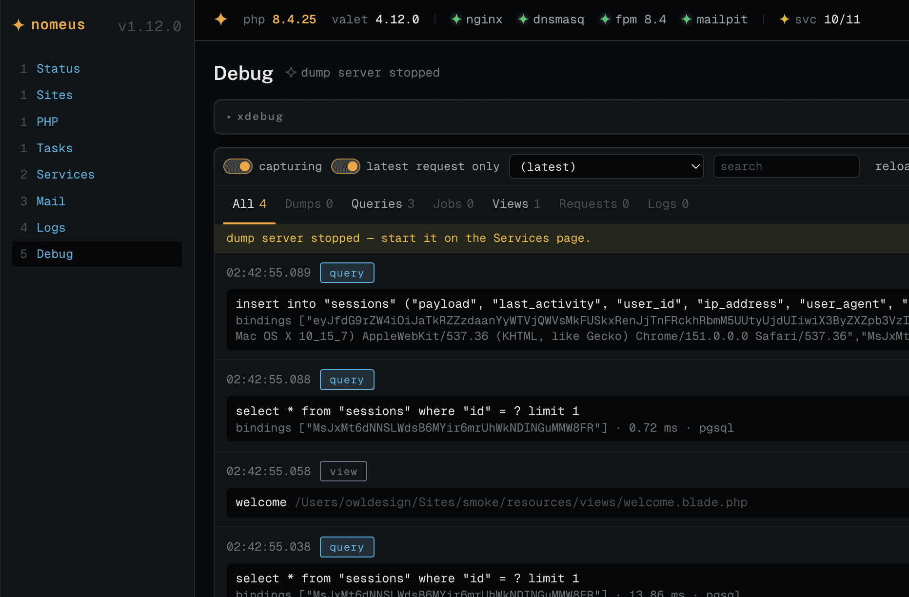

<p align="center">
  <a href="https://nomeus.dev"></a>
</p>

<p align="center">
  <a href="https://github.com/owldesign/nomeus/releases"></a>
  <a href="https://github.com/owldesign/nomeus/actions/workflows/ci.yml"></a>
  <a href="LICENSE"></a>
  
  
  <a href="https://nomeus.dev"></a>
</p>

<p align="center">
  <b>Nomeus</b> (νομεύς, <i>shepherd</i>) is a free, MIT-licensed local environment for Laravel on macOS — the jobs a paid one charges for, on the two things you already run: <b>Laravel Valet</b> and <b>Homebrew</b>.<br>
  One Laravel app that is a CLI, a dashboard and a menu bar app.
</p>

<p align="center">
  <code>curl -fsSL https://nomeus.dev/install | bash</code>
</p>

<br>

<p align="center">
  <a href="https://nomeus.dev"></a>
</p>

<br>

## What it does

- **Sites, PHP versions, isolation, TLS** — Valet, driven through `nomeus sites` / `php:*` and the Sites and PHP pages.
- **Services** — PostgreSQL, MySQL, MariaDB, Redis, Meilisearch, Typesense, SeaweedFS (S3), Reverb and Mailpit as native Homebrew binaries under nomeus-owned launchd agents: **multiple instances**, clone, **adopt from `brew services`**, doctor.
- **Mail** — a Mailpit instance with **one inbox per app** via tags from `nomeus/client`.
- **`nomeus init` / `nomeus.yml`** — link, tls, php, node, services, databases, mail, `.env`, scripts; idempotent.
- **`nomeus new shop --laravel --db=postgresql --redis --mail`** — scaffold → `nomeus.yml` → `init`, from the CLI or a form.
- **Logs** — every site's `storage/logs`, nginx and php-fpm; offset-based tail; `file:line` into your IDE.
- **Dumps** — nomeus's own dump server through an `auto_prepend_file`: **no package needed** for `dump()`/`dd()`; queries, jobs, views, requests and logs per request via the client package.
- **Xdebug** — per PHP version: **off / on / trigger / detect** (detect follows your IDE).
- **Node** — versions through fnm, `.nvmrc` pins honoured by `init`.
- **`nomeus doctor`** — sixty-odd checks across Valet, PHP, launchd, ports, ini files and retention; every warning names the exact fix, and the dashboard runs it as a task.
- **`nomeus mcp`** — your stack as tools for Claude Desktop, Claude Code and Cursor: *"what's on port 5433?"*, *"which sites use redis?"*, *"switch xdebug to trigger"*. `nomeus mcp:install claude`.
- **Everything is a task** — every dashboard action is a detached CLI run with a streaming log, so a Valet restart can't sever the request that asked for it.
- **[Nomeus.app](#nomeusapp)** — services, sites, a notification when an instance stops answering, launch at login, the dashboard in a window; Swift, ad-hoc signed.

<br>

<p align="center">
  
</p>

<br>

## Install

```bash
curl -fsSL https://nomeus.dev/install | bash -s -- --trust
```

Needs Xcode Command Line Tools and [Homebrew](https://brew.sh). The script clones this repo to `~/.nomeus/app` and runs
`install/install.sh`: Homebrew bundle, Valet, the app, `nomeus.test`, the php ini — ending with `nomeus doctor`. Re-running is a
no-op. `--trust` runs `valet trust` so the dashboard can act without password prompts. `/install` serves the raw
[`install/bootstrap.sh`](install/bootstrap.sh) — read it before you pipe it.

Then:

```bash
nomeus mail --create && nomeus services:create postgresql 17 --name=pg17
nomeus new shop --laravel --db=postgresql --redis --mail --secure
open https://nomeus.test
```

## A day with it

```bash
nomeus status                      # php, valet, nginx/dnsmasq/fpm, the flock
nomeus services:create redis       # standard port if free, else the next one
nomeus services:clone pg17 pg17-test --port=5434
nomeus services:adopt mysql@9.7    # take over what brew services runs; data copied, port kept
nomeus init ~/Sites/shop           # make the machine match nomeus.yml (skips what's already there)
nomeus xdebug:mode detect          # xdebug on while PhpStorm listens, off when it stops
nomeus php:ext redis --php=8.4     # extensions from the tap, fpm restarted
nomeus node:use 22 --site=shop     # .nvmrc + fnm install
nomeus logs shop --follow
nomeus dumps                       # the dump server's tail, in the terminal
nomeus doctor                      # every layer, with the fix for anything wrong
nomeus self-update                 # pull · deps · build · ini · doctor
```

`docs/commands.md` lists all fifty-odd commands; it's generated from the code (`nomeus docs:commands`), so it can't go stale.

## How it works, in ten lines

- **Valet** serves sites; nomeus reads its config and runs its CLI. `valet trust` is what lets the dashboard act.
- **Services** are launchd user agents (`dev.nomeus.svc.<name>`) running Homebrew binaries, data under `~/.nomeus/services/<name>/`. A driver describes each type.
- **Every dashboard mutation is a task** in `~/.nomeus/tasks/` — a detached process running the same CLI command.
- **php-fpm's environment is empty**; `Shell::env()` supplies PATH/HOME/locale for everything nomeus runs, and unsets nomeus's own `.env` so it never leaks into a site's `artisan`.
- **One ini per PHP version**, `99-nomeus.ini`, regenerated from two inputs: the dumps prepend and the Xdebug state. Nothing else touches php.ini.
- **Dumps**: the prepend sets `VAR_DUMPER_FORMAT=server` when `~/.nomeus/dumps/capture` exists; `dumps:serve` stores what arrives in SQLite; the Debug page polls it.
- **The client package** (`packages/client`, a path repository `init` adds for you) tags mail and records queries, jobs, views, requests and logs per request.
- **The API is the product**: `routes/api.php` is what the dashboard, the CLI-as-task pattern and the MCP server all use. Loopback only; mutations need `X-Nomeus: 1`.
- **Platform seams**: `ProcessManager` (launchd / systemd) and `PhpProvider` (brew / apt) are how Linux is being added without touching the macOS path.
- **The design**: one accent, star-shaped LEDs, motion only where it carries information. Tokens and component specs in [`docs/design`](docs/design).

## What it is not

- **Not notarized.** [Nomeus.app](#nomeusapp) is ad-hoc signed — no Apple developer account — so its first launch takes one `xattr` line. Databases: TablePlus through `nomeus db`.
- **Not on Windows.** Linux is in progress — the code is in ([`docs/linux.md`](docs/linux.md)), the Ubuntu proof isn't yet.
- **Not backed by a company.** Issues and pull requests here; the test suite on CI and a runbook per slice are the safety net.

## Docs

| | |
|---|---|
| [`docs/commands.md`](docs/commands.md) | every command, generated |
| [`docs/nomeus-yml.md`](docs/nomeus-yml.md) | the manifest |
| [`docs/layout.md`](docs/layout.md) | where things live: `~/.nomeus`, ports, launchd labels, ini files, sudoers |
| [`docs/mcp.md`](docs/mcp.md) | the MCP server and how to register it |
| [`docs/linux.md`](docs/linux.md) | the Linux port, what runs where |
| [`docs/design/`](docs/design) | tokens, component specs, the briefs |
| [`docs/runbooks.md`](docs/runbooks.md) | the build log — every slice, with every trap met on a real machine |
| [`apps/macos/`](apps/macos) | Nomeus.app — the menu bar shell (Swift, no developer account needed) |
| [`CHANGELOG.md`](CHANGELOG.md) | what each tag contains |

## Nomeus.app

A native menu bar app over the same API: services with start / stop / restart, sites with open-in-browser and reveal-in-Finder, the dashboard in a window, a notification when an instance stops answering, launch at login. Nothing is ported — it talks to `http://nomeus.test` like the SPA does.

Download `Nomeus-<version>.zip` from [Releases](https://github.com/owldesign/nomeus/releases), drop it in Applications, then — because it is ad-hoc signed, not notarized —

```bash
xattr -dr com.apple.quarantine /Applications/Nomeus.app
```

(on macOS 14 and 15, right-click → Open works too; macOS 26 calls the app "damaged" and offers nothing else). Requires macOS 14. Build it yourself with `cd apps/macos && scripts/bundle.sh`.

## Development

```bash
vendor/bin/pest          # every process and HTTP call is faked, nothing touches the machine
npm run build            # the dashboard (React, Tailwind v4, TanStack Query)
nomeus self-update       # from a checkout with a remote
cd apps/macos && swift test && swift run Nomeus   # the menu bar app; scripts/bundle.sh for Nomeus.app
```

The repo grew in vertical slices — plan, code with tests, an HTML runbook, a run on a real Mac, the fixes that run produced — and
[`docs/runbooks.md`](docs/runbooks.md) is that history. If you're reading the code, `app/Services` is the map:
`ValetBridge`, `ServiceManager` + `Services/*Driver`, `TaskRunner`, `Init/InitPlanner`, `Dumps/`, `Php/`, `Doctor/`, `Mcp/`.

[`CONTRIBUTING.md`](CONTRIBUTING.md) has the two-checkout setup, the test rules the suite enforces, and how releases are cut;
[`CHANGELOG.md`](CHANGELOG.md) is generated from the tags.

## License

MIT — [`LICENSE`](LICENSE). Fonts in `public/fonts` and `site/fonts` are SIL OFL (licenses alongside).

<p align="center"><sub>ZHUK LLC / Owl Design · <a href="https://nomeus.dev">nomeus.dev</a></sub></p>
